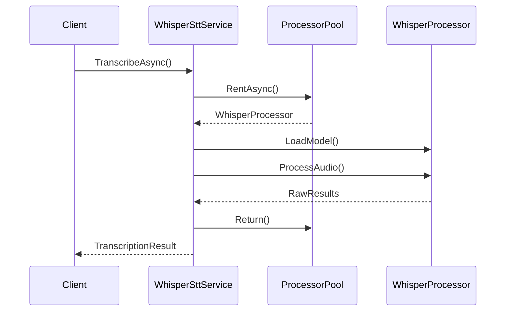

# LOC-40: Whisper.net Integration — Architecture

**Phase 2: Architecture** | Agent: Opus (architect)

## Solution Design

### Component Diagram

```mermaid
graph TD

    I1[ISttService Interface] --> W1[WhisperSttService]
    W1 --> P1[ProcessorPool<WhisperProcessor>]
    W1 --> C1[Configuration]
    W1 --> D1[DependencyResolver]

    subgraph DTOs
        D2[TranscriptionResult] --> D3[TranscriptionSegment]
    end

    subgraph Whisper.NET
        P1 --> WN1[WhisperProcessor (thread-unsafe)]
        WN1 --> M1[ModelLoader]
    end
```

### Key Components

#### 1. `WhisperSttService`
- Implements `ISttService`
- Uses `ProcessorPool<T>` for thread safety
- Handles audio format conversion (resamples to 16kHz mono)
- Caches model files from `Whisper.ModelPath` config

**Interface Implementation**:
```csharp
public class WhisperSttService : ISttService {
    private readonly ProcessorPool<WhisperProcessor> _processors;
    private readonly WhisperOptions _options;

    public WhisperSttService(ProcessorPool<WhisperProcessor> processors, IOptions<WhisperOptions> options) {
        _processors = processors;
        _options = options.Value;
    }

    // ISttService implementations using processor pool
}
```

#### 2. DTOs
- **`TranscriptionResult`**: Aggregates full transcription metadata
- **`TranscriptionSegment`**: Word/phrase with timestamps

**Mapping Strategy**:
```csharp
// WhisperSegment → TranscriptionSegment
var segment = new TranscriptionSegment(
    text: whisperResult.Text,
    start: TimeSpan.FromMilliseconds(whisperResult.StartMs),
    end: TimeSpan.FromMilliseconds(whisperResult.EndMs),
    confidence: whisperResult.Confidence
);
```

#### 3. Processor Pooling
- Thread-safety via `ProcessorPool<T>`:
```csharp
public class ProcessorPool<T> : IAsyncDisposable {
    private readonly SemaphoreSlim _semaphore;
    private readonly List<T> _processors;

    public async ValueTask<T> RentAsync(CancellationToken ct) {
        await _semaphore.WaitAsync(ct);
        return _processors[...];
    }

    public void Return(T processor) {
        // Validate and return to pool
    }
}
```

- Initializes with CUDA-accelerated processors:
```csharp
services.AddSingleton<ProcessorPool<WhisperProcessor>>(sp => {
    var options = sp.GetRequiredService<IOptions<WhisperOptions>>().Value;
    var processors = Enumerable.Range(0, options.Parallelism)
        .Select(_ => new WhisperProcessor(options.ModelSize, useCuda: options.UseGpu))
        .ToList();
    return new ProcessorPool<WhisperProcessor>(processors);
});
```

#### 4. Dependency Registration
```xml
<!-- LockNListen.Infrastructure.csproj -->
<Project>
    <ItemGroup>
        <PackageReference Include="Whisper.net" Version="1.9.0" />
        <PackageReference Include="Whisper.net.Runtime.Cuda" Version="1.9.0" />
    </ItemGroup>
</Project>
```

```csharp
// Assembly.cs
[assembly: HostingStartup(typeof(WhisperHostingStartup))]

public class WhisperHostingStartup : IHostingStartup {
    public void Configure(IWebHostBuilder builder) {
        builder.ConfigureServices((_, services) => {
            services.AddSingleton<ISttService, WhisperSttService>();
            services.AddSingleton<ProcessorPool<WhisperProcessor>>();
            services.Configure<WhisperOptions>(Configuration.GetSection("Whisper"));
        });
    }
}
```

## Configuration Pattern
```json
{
  "Whisper": {
    "ModelPath": "./models/whisper",
    "ModelSize": "small",
    "Language": "en",
    "UseGpu": true,
    "Parallelism": 4
  }
}
```

## Thread Safety
- WhisperProcessor is NOT thread-safe
- ProcessorPool ensures:
  1. One processor per transcription request
  2. Async-agnostic safe return/dispose
  3. Configurable parallelism level

## Audio Processing Pipeline


## Next Steps
✅ Architecture review complete
→ Dispatching implementation to Qwen3-Coder via `dispatch.sh`